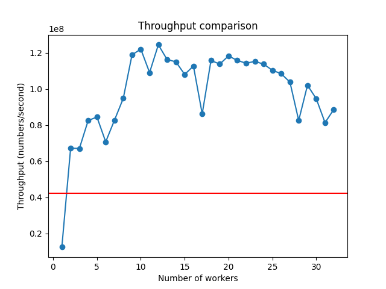
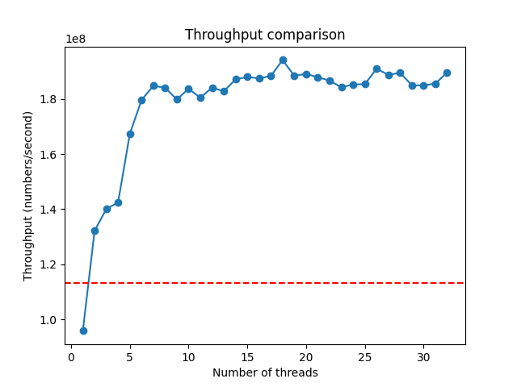

# Anomaly Detection
This project aims to demonstrate efficient data generation and anomaly detection using python. 

### Example Usage

1. Generate data to a file
```bash
python parallel_generator.py --num_samples 1000000000 --file generated.npy --time --type normal --seasonality "{\"amplitude\": 0.1, \"period\": 200}" --sync
```

2. Process data from the generated file
```bash
python parallel_consumer.py --file generated.npy --time --type stl
```

## Structure

The code is split into two main sections, Data Generation and Data Consumption.

### Data Generation

There are two classes in this section. 
- Class `Generator` is simple and is used for testing purposes. This simply generates the required distribution with numpy function calls. 

- Class `MultiThreadedGenerator` is the key class which generates the Data stream parallely. We use Numpy Generators to create multiple random number generators from the same seed and use them to parallely fill an array with the random numbers. We can then simple translate the distributions for the required parameters and get the final stream in a chunk of size n. 
    - There are 3 ways to generate numbers. Simply calling `generate()` will return with the filled numpy array. Calling `generate_to_file()` will generate the array and save it to a file. This function is optimized for SSDs and low latency drives and cannot be used with ordered stream (the order in which it saves is random). The `generate_to_file_sync()` can be used to write to the disk serially which will preserve order and can be used on HDDs and high latency devices.

### Data Consumers
The structure is similar to Data Generation. We have 2 classes `Consumer` and `MultiThreadedConsumer`
- Class `Consumer` is simple with numpy and simple transformations
- Class `MultiThreadedConsumer` contains code for parallel processing of Data stream. We use multiple threads to process data simultaneously and create the anomaly mask for the input data stream. We can later compress this mask using `np.where()` to only report the indices where there is an anomaly. Here we only have two function `detect_anomaly` and `detect_anomaly_from_file`. `detect_anomaly` uses multiple threads to parallely process the data and `detect_anomaly_from_file` serially reads from a file and processes 

Finally there is `single_machine.py` which simulates the end case scenario where data stream is generated and processed in chunks for an arbitrary length. 

## Algorithm for Anomaly Detection

The STL (Seasonal-Trend decomposition using Loess) algorithm is a method for decomposing time series data into three components: Seasonal, Trend, and Residual (or noise). This decomposition can be useful for anomaly detection by analyzing the residual component for outliers.

### How STL Works
1. **Seasonal Component:** Captures the repeating patterns or cycles in the data (e.g., daily, weekly, yearly).
2. **Trend Component:** Captures the long-term progression or movement in the data.
3. **Residual Component:** Captures the remaining part of the data after removing the seasonal and trend components, which includes noise and anomalies.

### Steps in STL Decomposition
1. **Seasonal Extraction:** The seasonal component is extracted using a moving average or Loess smoothing.
2. **Trend Extraction:** The trend component is extracted by smoothing the data after removing the seasonal component.
3. **Residual Calculation:** The residual component is calculated by subtracting the seasonal and trend components from the original data.

### Pros of STL
1. **Flexibility:** Can handle data with complex seasonal patterns and varying trends.
2. **Robustness:** Can be robust to outliers, especially when using robust Loess.
3. **Interpretability:** Provides clear and interpretable components (seasonal, trend, residual).

### Cons of STL
1. **Computationally Intensive:** Can be slow for very large datasets due to the iterative nature of Loess smoothing.
2. **Parameter Sensitivity:** Requires careful tuning of parameters like the seasonal and trend window sizes.
3. **Not Suitable for All Data:** May not perform well on data without clear seasonal or trend components.

STL Decomposition is implemented in file `parallel_consumer.py` as the following:

```python
def _stl(data, out, first, last, params):
    seasonal_period = params.get("seasonal", 7)
    trend = np.convolve(data[first:last], np.ones(seasonal_period) / seasonal_period, mode="valid")
    trend = np.concatenate((trend, np.full(len(data[first:last]) - len(trend), trend[-1])))
    seasonal = data[first:last] - trend
    resid = data[first:last] - trend - seasonal
    threshold = params.get("threshold", 3)
    out[first:last] = np.greater(np.abs(resid), threshold * np.std(resid))
```

Here, `out` is the output array. This function is run in parallel over the variable `data`, and the variables `first` and `last` specify the chunk on which a specific instance needs to work upon.

There is a more optimized way of using STL via the statsmodels library in Python. This is not implemented in the code since that would defeat the purpose of the test.
```python
def _stl(data, out, first, last, params):
    stl = STL(data[first:last], seasonal=params.get("seasonal", 7))
    result = stl.fit()
    resid = result.resid
    threshold = params.get("threshold", 3)
    out[first:last] = np.greater(np.abs(resid), threshold * np.std(resid))
```
This new (inimplemented) function is 10x faster than the numpy implementation above.

# Final Results
The provided code is well optimized by multithreading and has optimal memory utilization by using memmaps on non-volatile storage. The code performs the best on computers with multiple cores and fast, low-latency solid state drives. There are demo opttions available in both `MultiThreadedGenerator` and `MultiThreadedConsumer` via command line options. On my personal laptop with 6 cores and NVMe Storage, I can acheive >10^8 floats per second of simultaneous generation and processing. The code is structured so as to do generation and processing on different systems, since both of them are multi-threaded and can use many threads. Here are the results generated via the Demo of each Class. The red line is the throughput of the naive implementations in `generator.py` and `consumer.py`

<figure>
  
  <figcaption>Generator Performance</figcaption>
</figure>

<figure>
  
  <figcaption>Consumer Performance</figcaption>
</figure>